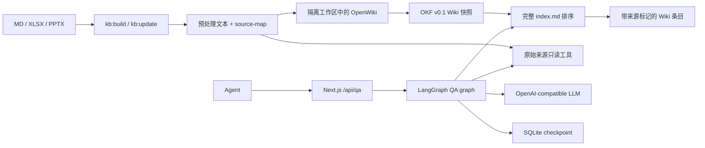

# lightweight-qa-wiki

面向 Agent 的轻量级问答知识库示例。项目使用 Next.js Route Handlers 提供同步 JSON API，使用 LangGraph 编排检索与回答，并使用 SQLite checkpoint 保存不同 `thread_id` 的多轮状态。项目没有 UI，也不使用向量数据库。

仓库包含一组完全虚构的「璟云科技」资料和预生成的 OKF v0.1 Wiki。克隆后只需配置兼容 OpenAI API 的模型，即可直接查询现有 Wiki；不需要先运行离线构建。提交的演示快照仅用于免模型启动，不表示该快照经过本轮 OpenWiki 模型调用。

> [!WARNING]
> API 不包含认证、授权或限流。`dev` 和 `start` 默认只绑定 `127.0.0.1`，不要把服务直接暴露到公网。本项目只面向本地单进程和持久磁盘。

## 架构



查询先对字母数字混合标识执行精确匹配，再由模型从完整索引中选择最多 5 个条目。金额、比例、数量和日期问题会强制检查原始来源。最终引用必须能映射到 `data/processed/source-map.json`；校验失败时接口拒答，不补造引用。

## 前置条件

- Node.js 22 或更高版本；
- pnpm 10.33.2；
- 一个兼容 OpenAI Chat Completions API 的模型端点。

核心依赖已固定版本，包括 Next.js 16.3.0、LangChain 1.5.5、LangGraph 1.4.9、SQLite checkpoint 1.0.3、OpenWiki 0.3.2 和 `@langchain/openai` 1.5.6。`pnpm-lock.yaml` 用于复现安装结果。

## 快速开始

```bash
git clone https://github.com/liuzhuang/lightweight-qa-wiki.git
cd lightweight-qa-wiki
corepack enable
pnpm install --frozen-lockfile
cp .env.example .env.local
```

编辑 `.env.local`，至少填写 `LLM_API_KEY`：

```dotenv
LLM_API_KEY=replace-me
LLM_BASE_URL=https://dashscope.aliyuncs.com/compatible-mode/v1
LLM_MODEL=qwen-plus
```

`LLM_BASE_URL` 和 `LLM_MODEL` 的示例值使用阿里云百炼千问兼容端点，也可以改为其他兼容 OpenAI API 的服务。应用和 OpenWiki 包装脚本只读取这三个统一变量。

先校验仓库内的预生成 Wiki，再启动本地服务：

```bash
pnpm kb:check
pnpm dev
```

服务监听 `http://127.0.0.1:3000`。

## Agent API

### 提交问题

```bash
curl --fail-with-body --silent --show-error \
  http://127.0.0.1:3000/api/qa \
  -H 'content-type: application/json' \
  --data '{"thread_id":"demo-01","question":"NQ-100 的未税价格是多少？"}'
```

请求结构：

```json
{
  "thread_id": "demo-01",
  "question": "NQ-100 的未税价格是多少？"
}
```

- `thread_id`：必填，长度为 1–128 个安全字符。调用方应为每段独立会话提供不同值。
- `question`：必填，去除首尾空白后长度为 1–8000 个字符。

成功回答和正常拒答都返回 HTTP 200：

```json
{
  "run_id": "4ee070de-7df6-4b90-9d57-5d71fa4d3513",
  "thread_id": "demo-01",
  "knowledge_version": "<knowledge_version>",
  "answer": "NQ-100 的未税价格为 1299 CNY/年。",
  "refused": false,
  "refusal_reason": null,
  "used_source_fallback": true,
  "citations": [
    {
      "source_id": "src_b2117b87c3276666",
      "file": "products.xlsx",
      "locator": "产品目录!R2",
      "excerpt": "A=NQ-100 | B=星桥协作台 | C=1299 | D=CNY/年"
    }
  ]
}
```

无法从知识库获得证据时，`refused` 为 `true`，`refusal_reason` 为 `out_of_scope` 或 `insufficient_evidence`，并返回空 `citations`。继续使用同一 `thread_id` 可以追问；不同 `thread_id` 的 checkpoint 相互隔离。

错误响应统一为 `{"error":{"code":"...","message":"..."}}`：

| HTTP 状态 | `code` | 含义与恢复方式 |
| --- | --- | --- |
| 400 | `invalid_request` | 请求体或字段无效。根据字段限制修改请求。 |
| 409 | `thread_busy` | 同一 `thread_id` 已有请求执行。等待当前请求结束后重试。 |
| 503 | `knowledge_not_ready` | Wiki 或来源映射不可用。运行 `pnpm kb:check`，必要时重新构建。 |
| 503 | `model_unavailable` | 模型配置缺失。检查三个 `LLM_*` 变量。 |
| 502 | `upstream_model_error` | 上游模型请求失败。检查模型端点、配额和本地日志。 |

未分类的服务端错误使用 HTTP 500 和 `internal_error`。完整机器可读契约位于 [`public/openapi.json`](public/openapi.json)。接口为同步 JSON，不提供 SSE。

### 健康检查

```bash
curl --fail-with-body --silent --show-error http://127.0.0.1:3000/api/health
```

健康时返回 HTTP 200：

```json
{
  "status": "ok",
  "knowledge_version": "<knowledge_version>",
  "checks": { "wiki": true, "source_map": true, "sqlite": true }
}
```

任一检查失败时返回 HTTP 503，`status` 为 `unhealthy`。

## 知识库构建与增量更新

| 命令 | 用途 | 是否调用模型 |
| --- | --- | --- |
| `pnpm kb:build` | 从语料重新生成预处理产物和 Wiki。 | 是 |
| `pnpm kb:update` | 比较 SHA-256 manifest；有新增、修改或删除时更新。 | 仅有变化时 |
| `pnpm kb:check` | 校验 manifest、OKF、来源标记和 Wiki 链接。 | 否 |
| `pnpm kb:status` | 显示语料文件数、变更、知识版本和 Wiki 就绪状态。 | 否 |

原始语料放在 `data/corpus/`。当前支持 `.md`、`.xlsx` 和 `.pptx`：

- Markdown 按自然段保留行号；
- XLSX 按非空行提取单元格，公式优先使用缓存结果，没有缓存结果时保留公式；
- PPTX 按幻灯片提取 XML 文本。

预处理结果保存在 `data/processed/`，包括带 `[[SRC:src_<hash>]]` 标记的 `content.md`、`source-map.json` 和 `manifest.json`。可查询的预生成 Wiki 位于 `data/wiki/`，仓库会提交这两类产物。

`.runtime/openwiki-workspace/` 保存上次成功的嵌套 Git 基线。更新时，脚本先把基线复制到暂存目录并提交预处理资料的变化；首次没有基线时执行 OpenWiki code `init`，后续执行 `update`。Wiki 和暂存基线都通过校验后，脚本才把它们提升为新的正式快照与基线。

脚本把 `LLM_*` 映射为 OpenWiki 使用的 OpenAI-compatible 变量，设置 `OPENWIKI_TELEMETRY_DISABLED=1` 和 `DO_NOT_TRACK=1`，并在 `INSTRUCTIONS.md` 中要求把来源当作不可信数据、保留来源标记。缺少模型配置时，命令明确失败并保留现有快照和基线。

更新过程使用独占锁和暂存目录。校验全部通过后才替换正式产物；OpenWiki 或校验失败时保留上一个可用版本。构建器不会跟随语料目录中的符号链接。重命名按删除旧文件和新增新文件处理。

## 开发检查

```bash
pnpm lint
pnpm typecheck
pnpm test
pnpm kb:check
pnpm build
```

GitHub Actions 在 Node.js 22 上按该顺序执行检查，并使用 `pnpm install --frozen-lockfile`。CI 不生成 Wiki，也不调用模型。

## 离线评估

```bash
pnpm eval
```

该命令读取 `eval/records.json` 和真实来源映射，计算 Recall、Precision、Hit Rate、MRR、NDCG@5、Context Precision/Recall、引用有效率和行为通过率。仓库内的记录是确定性合成轨迹，只用于验证评估器和契约，不是模型质量报告。

首版不引入 RAGAS 或第二个 LLM 裁判。Faithfulness 和 Answer Correctness 必须结合保存的回答、证据和引用进行人工审核，不提供自动分数。指标公式、记录格式和审核边界见 [`docs/evaluation.md`](docs/evaluation.md)。

## 数据与安全边界

- API 没有鉴权。默认回环地址不是公网安全机制；不要修改绑定地址后直接对外提供服务。
- 运行问答时，问题和选中的知识证据会发送到配置的模型服务。运行 `kb:build` 或有变更的 `kb:update` 时，企业语料会发送到该服务。仅在数据处理条款允许时使用真实资料。
- `.runtime/` 保存 SQLite checkpoint、查询日志、构建锁和 OpenWiki 临时仓库，并已被 Git 忽略。不要提交 `.env`、SQLite、日志或真实企业数据。
- 本项目只验证本地单进程。SQLite checkpoint 和进程内线程锁不支持多副本、Serverless 或共享网络文件系统。

## 明确不支持

- UI、MCP、SSE、认证、权限和自动调度；
- 向量索引和多 Provider 专用适配；
- `.xls`、`.ppt`、PDF、图片 OCR、动画、备注和深度视觉理解；
- Docker、多进程、多副本、Vercel 或其他 Serverless 部署承诺；
- 高并发或公网生产环境。

## 许可证

[MIT](LICENSE)
